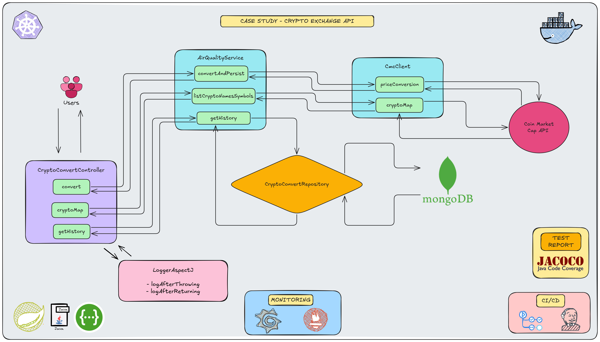

# Case Study - Crypto Exchange Api

<p align="center">
    
</p>

### 📖 Information

<h3>Project Definition (CryptoExchange API)</h3>
<p>
  A Spring Boot service that converts an amount from one cryptocurrency to another using CoinMarketCap (CMC),
  persists each conversion as a history record, and exposes pageable search &amp; discovery endpoints.
  All responses are wrapped in <code>CustomResponse&lt;T&gt;</code>; paged payloads use
  <code>CustomPagingResponse&lt;T&gt;</code>.
</p>

<h4>End-to-end flow (convert API):</h4>
<ul>
  <li>
    Client sends <code>POST /api/convert</code> with <code>ConvertRequest</code>:
    <code>{ from, to, amount }</code> (e.g., <code>BTC</code> → <code>ARB</code>, <code>amount=100</code>).
  </li>
  <li>
    Service fetches the conversion rate from CMC, computes <code>convertedAmount</code>, and persists a record:
    <ul>
      <li><code>transactionId</code> (UUID)</li>
      <li><code>createdAt</code> (ISO-8601)</li>
      <li><code>from</code>, <code>to</code>, <code>amount</code>, <code>convertedAmount</code></li>
    </ul>
  </li>
  <li>
    Returns <code>201 Created</code> with <code>CustomResponse&lt;CryptoConvert&gt;</code> containing the saved record.
  </li>
</ul>

<h4>History search:</h4>
<p>
  <code>POST /api/convert/history</code> accepts <code>FilterServicePagingRequest</code> and returns
  <code>CustomPagingResponse&lt;CryptoConvertResponse&gt;</code>. Filtering supports:
</p>
<ul>
  <li><code>from</code>, <code>to</code> (symbols)</li>
  <li>amount range: <code>minAmount</code> .. <code>maxAmount</code></li>
  <li>convertedAmount range: <code>minConvertedAmount</code> .. <code>maxConvertedAmount</code></li>
  <li>createdAt range: <code>createdAtFrom</code> .. <code>createdAtTo</code></li>
  <li><code>transactionIdContains</code> (substring)</li>
</ul>
<p>
  Pagination &amp; sorting are provided in the request (e.g., <code>pageNumber</code>, <code>pageSize</code>,
  <code>sortBy</code>, <code>sortDirection</code>).
</p>

<h4>Crypto map (name + symbol):</h4>
<ul>
  <li>
    <code>GET /api/convert/map</code> returns a paged list of cryptocurrencies (name &amp; symbol) via CMC
    <code>/v1/cryptocurrency/map</code>.
  </li>
  <li>
    Query params:
    <ul>
      <li><code>page</code> (1-based, default <code>1</code>, min <code>1</code>)</li>
      <li><code>size</code> (default <code>20</code>, range <code>1..5000</code>)</li>
    </ul>
  </li>
  <li>
    Response: <code>CustomPagingResponse&lt;CryptoNameSymbolResponse&gt;</code> with standard paging metadata.
  </li>
</ul>

<h4>Error semantics:</h4>
<ul>
  <li><code>201 Created</code> — Successful conversion persisted (<code>/api/convert</code>)</li>
  <li><code>200 OK</code> — Successful paged responses (<code>/history</code>, <code>/map</code>)</li>
  <li><code>400 Bad Request</code> — Validation errors (invalid symbols, amounts, or paging inputs)</li>
  <li><code>502 Bad Gateway</code> — Upstream CMC call failed or unavailable (convert/map)</li>
</ul>

<h4>Caching &amp; invalidation:</h4>
<p>
  CMC results are cached to reduce latency and request volume. Cache eviction runs on a fixed schedule configured via
  <code>cmc.cache-ttl</code> and a lifecycle hook (<code>@PostConstruct</code>) to ensure fresh state on startup.
</p>

<h4>OpenAPI (Swagger):</h4>
<p>
  The controller is annotated with detailed <code>@Operation</code> and <code>@ApiResponse</code> metadata. Explore at:
  <code>http://localhost:1927/swagger-ui/index.html</code> (port configurable).
</p>


### Explore Rest APIs

### Explore Rest APIs

Endpoints Summary
<table style="width:100%; border-collapse: collapse;">
  <thead>
    <tr style="background-color:#f2f2f2;">
      <th style="border:1px solid #ddd; padding:8px; text-align:left;">Method</th>
      <th style="border:1px solid #ddd; padding:8px; text-align:left;">URL</th>
      <th style="border:1px solid #ddd; padding:8px; text-align:left;">Description</th>
      <th style="border:1px solid #ddd; padding:8px; text-align:left;">Request Body</th>
      <th style="border:1px solid #ddd; padding:8px; text-align:left;">Headers/Path</th>
      <th style="border:1px solid #ddd; padding:8px; text-align:left;">Response</th>
      <th style="border:1px solid #ddd; padding:8px; text-align:left;">Status Codes</th>
    </tr>
  </thead>
  <tbody>
    <tr>
      <td style="border:1px solid #ddd; padding:8px;">POST</td>
      <td style="border:1px solid #ddd; padding:8px;"><code>/api/convert</code></td>
      <td style="border:1px solid #ddd; padding:8px;">Convert an amount from one crypto to another and persist the result</td>
      <td style="border:1px solid #ddd; padding:8px;"><code>ConvertRequest</code></td>
      <td style="border:1px solid #ddd; padding:8px;">—</td>
      <td style="border:1px solid #ddd; padding:8px;">CustomResponse&lt;CryptoConvert&gt;</td>
      <td style="border:1px solid #ddd; padding:8px;">201, 400, 502</td>
    </tr>
    <tr>
      <td style="border:1px solid #ddd; padding:8px;">POST</td>
      <td style="border:1px solid #ddd; padding:8px;"><code>/api/convert/history</code></td>
      <td style="border:1px solid #ddd; padding:8px;">Paged search of conversion history with filters, pagination and sorting</td>
      <td style="border:1px solid #ddd; padding:8px;"><code>FilterServicePagingRequest</code></td>
      <td style="border:1px solid #ddd; padding:8px;">—</td>
      <td style="border:1px solid #ddd; padding:8px;">CustomResponse&lt;CustomPagingResponse&lt;CryptoConvertResponse&gt;&gt;</td>
      <td style="border:1px solid #ddd; padding:8px;">200, 400</td>
    </tr>
    <tr>
      <td style="border:1px solid #ddd; padding:8px;">GET</td>
      <td style="border:1px solid #ddd; padding:8px;"><code>/api/convert/map</code></td>
      <td style="border:1px solid #ddd; padding:8px;">List cryptocurrencies (name + symbol) with pagination</td>
      <td style="border:1px solid #ddd; padding:8px;">—</td>
      <td style="border:1px solid #ddd; padding:8px;">Query: <code>page</code> (default 1), <code>size</code> (default 20, max 5000)</td>
      <td style="border:1px solid #ddd; padding:8px;">CustomResponse&lt;CustomPagingResponse&lt;CryptoNameSymbolResponse&gt;&gt;</td>
      <td style="border:1px solid #ddd; padding:8px;">200, 502</td>
    </tr>
  </tbody>
</table>

### Technologies

---
- Java 25
- Spring Boot 3.0
- Restful API
- Open Api (Swagger)
- Maven
- Junit5
- Mockito
- Integration Tests
- Docker
- Docker Compose
- CI/CD (Github Actions)
- Postman
- Prometheus
- Grafana
- Kubernetes
- JaCoCo (Test Report)
- AOP
- Jenkins

### Postman

```
Import postman collection under postman_collection folder
```


### Prerequisites

#### Define Variable in .env file

```
MONGO_DB_HOST=localhost
MONGO_DB_PORT=27017
MONGO_DB_NAME=cryptoexchangedatabase
COIN_MARKET_CAP_API_KEY={YOUR_COIN_MARKET_CAP_API_KEY}
```

### Open Api (Swagger)

```
http://localhost:1927/swagger-ui/index.html
```

---

### JaCoCo (Test Report)

After the command named `mvn clean install` completes, the JaCoCo report will be available at:
```
target/site/jacoco/index.html
```
Navigate to the `target/site/jacoco/` directory.

Open the `index.html` file in your browser to view the detailed coverage report.

---

### Maven, Docker and Kubernetes Running Process


### Maven Run
To build and run the application with `Maven`, please follow the directions shown below;

```sh
$ cd git clone https://github.com/Rapter1990/cryptoexchangeapi.git
$ cd cryptoexchangeapi
$ mvn clean install
$ mvn spring-boot:run
```

---

### Docker Run
The application can be built and run by the `Docker` engine. The `Dockerfile` has multistage build, so you do not need to build and run separately.

Please follow directions shown below in order to build and run the application with Docker Compose file;

```sh
$ cd cryptoexchangeapi
$ docker-compose up -d
```

If you change anything in the project and run it on Docker, you can also use this command shown below

```sh
$ cd cryptoexchangeapi
$ docker-compose up --build
```

To monitor the application, you can use the following tools:

- **Prometheus**:  
  Open in your browser at [http://localhost:9090](http://localhost:9090)  
  Prometheus collects and stores application metrics.

- **Grafana**:  
  Open in your browser at [http://localhost:3000](http://localhost:3000)  
  Grafana provides a dashboard for visualizing the metrics.  
  **Default credentials**:
    - Username: `admin`
    - Password: `admin`

Define prometheus data source url, use this link shown below

```
http://prometheus:9090
```

---

### Kubernetes Run
To run the application, please follow the directions shown below;

- Start Minikube

```sh
$ minikube start
```

- Open Minikube Dashboard

```sh
$ minikube dashboard
```

- Revise `CMC_API_KEY` in `cryptoexchangeapi-secrets.yml` according to your usage


- To deploy the application on Kubernetes, apply the Kubernetes configuration file underneath k8s folder

```sh
$ kubectl apply -f k8s
```

- To open Prometheus, click tunnel url link provided by the command shown below to reach out Prometheus

```sh
minikube service prometheus-service
```

- To open Grafana, click tunnel url link provided by the command shown below to reach out Prometheus

```sh
minikube service grafana-service
```

- Define prometheus data source url, use this link shown below

```
http://prometheus-service.default.svc.cluster.local:9090
```

---
### Docker Image Location

```
https://hub.docker.com/repository/docker/noyandocker/cryptoexchangeapi/general
https://hub.docker.com/repository/docker/noyandocker/cryptoexchangeapi-jenkins/general
```

### Jenkins

- Go to `jenkins` folder
- Run `docker-compose up -d`
- Open Jenkins in the browser via `localhost:8080`
- Define `credentials` for `Github General token` used by  `GIT_REPO_ID` and `docker-hub-credentials` for `Docker` `Username` and `Password`
- Go to pipeline named `cryptoexchangeapi`
- Run Pipeline
- Show `Pipeline Step` to verify if it succeeded or failed

### 📸 Screenshots

<details>
<summary>Click here to show the screenshots of project</summary>
    <p> Figure 1 </p>
    
    <p> Figure 2 </p>
    
    <p> Figure 3 </p>
    
    <p> Figure 4 </p>
    
    <p> Figure 5 </p>
    
    <p> Figure 6 </p>
    
    <p> Figure 7 </p>
    
    <p> Figure 8 </p>
    
    <p> Figure 9 </p>
    
    <p> Figure 10 </p>
    
    <p> Figure 11 </p>
    
    <p> Figure 12 </p>
    
    <p> Figure 13 </p>
    
    <p> Figure 14 </p>
    
    <p> Figure 15 </p>
    
    <p> Figure 16 </p>
    
    <p> Figure 17 </p>
    
</details>


### Contributors

- [Sercan Noyan Germiyanoğlu](https://github.com/Rapter1990)